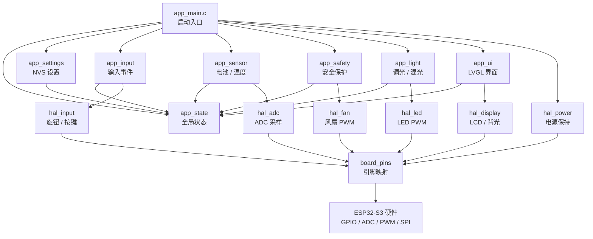
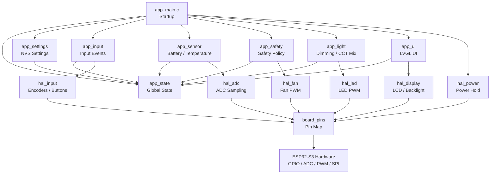

# ESP32-S3 25W Bi-Color LED Fill Light

[中文](#中文) | [English](#english)

Firmware for an open-source 25 W bi-color LED fill light based on ESP32-S3,
ESP-IDF, and LVGL.

- Hardware project: <https://oshwhub.com/jabal/project_ayowptva>
- Firmware target: ESP32-S3
- Framework: ESP-IDF
- UI: SPI LCD + LVGL

---

## 中文

### 项目简介

这是一个 25W 冷暖双色补光灯固件项目，面向 ESP32-S3 主控开发。固件负责
电源保持、冷暖光 PWM 调光、风扇温控、电池检测、NTC 温度检测、LCD 显示、
按键旋钮输入、安全保护、参数保存和本地 Web OTA 升级。

硬件开源地址：

<https://oshwhub.com/jabal/project_ayowptva>

详细软件规格见 [SOFTWARE_DEVELOPMENT.md](SOFTWARE_DEVELOPMENT.md)。
硬件待确认项见 [docs/HARDWARE_TODO.md](docs/HARDWARE_TODO.md)。

### 特色功能

- **25W 冷暖双色补光**：冷光、暖光双通道 PWM 输出，支持 2700K 到 6500K 色温调节。
- **亮度和色温双旋钮控制**：一个旋钮调亮度，一个旋钮调色温，适合拍摄现场快速操作。
- **LCD 状态显示**：显示亮度、色温、电池百分比、电池电压、NTC 温度和故障状态。
- **电池供电管理**：支持 2S 电池电压检测、电量估算、低压降额和严重低压关机。
- **智能风扇温控**：根据温度自动调节风扇转速，高温时优先保护 LED 和电池。
- **完整安全策略**：内置低压、过温、NTC 异常、ADC 异常等保护逻辑。
- **参数掉电保存**：亮度、色温、灯光开关、背光亮度和风扇手动状态保存到 NVS。
- **本地 Web OTA**：设备可开启 SoftAP，通过浏览器上传新固件。
- **开源友好架构**：硬件访问集中在 HAL 层，GPIO 映射集中在 `board_pins`，便于移植和维护。

### 当前固件状态

当前固件已集成：

- 电源保持与安全关机流程
- 冷光 / 暖光 LED PWM HAL
- 风扇 PWM HAL
- ADC HAL、电池算法和 NTC 温度算法
- 输入事件系统
- ST7789 兼容 SPI LCD 与 LVGL 界面框架
- 线程安全的全局状态模型
- 低压、过温和传感器异常保护
- NVS 设置保存
- 设置页和 WiFi OTA 页面

部分硬件参数仍需样机确认，例如 LCD 控制器细节、背光极性、风扇低占空比启动、
LED 驱动 PWM 推荐频率、ADC 标定误差和温度安装位置滞后等。详见
[docs/HARDWARE_TODO.md](docs/HARDWARE_TODO.md)。

### 软件架构

固件采用分层架构。应用层只处理业务逻辑，HAL 层封装 ESP-IDF 外设访问，
板级层集中管理 GPIO 和硬件映射。



### 目录结构

```text
.
├── main/                  # app_main 启动入口
├── components/
│   ├── board/             # 板级初始化和 GPIO 映射
│   ├── hal_power/         # 电源保持和关机
│   ├── hal_led/           # 冷暖光 PWM
│   ├── hal_fan/           # 风扇 PWM
│   ├── hal_adc/           # ADC 采样
│   ├── hal_input/         # 旋钮和按键输入
│   ├── hal_display/       # LCD 和背光
│   ├── app_state/         # 全局状态
│   ├── app_light/         # 亮度 / 色温 / 混光
│   ├── app_sensor/        # 电池和温度算法
│   ├── app_safety/        # 安全保护
│   ├── app_input/         # 输入事件处理
│   ├── app_ui/            # LVGL UI
│   ├── app_settings/      # NVS 设置保存
│   └── app_ota/           # 本地 Web OTA
├── docs/
│   └── HARDWARE_TODO.md   # 硬件待确认项
└── SOFTWARE_DEVELOPMENT.md
```

### 构建方法

安装并进入 ESP-IDF 环境后执行：

```bash
idf.py set-target esp32s3
idf.py build
```

烧录和串口监视：

```bash
idf.py flash monitor
```

### 主要硬件映射

| 功能 | GPIO | 说明 |
|---|---:|---|
| 冷光 PWM | GPIO38 | `LEDC_PWM` |
| 暖光 PWM | GPIO40 | `LEDW_PWM` |
| 风扇 PWM | GPIO45 | 启动绑带相关引脚，需样机确认 |
| 电池 ADC | GPIO9 | 2S 电池 300k / 100k 分压 |
| NTC ADC | GPIO3 | 10k B3950 NTC |
| 电源保持 | GPIO18 | `PWR_EN` |
| 电源键检测 | GPIO6 | `EC_KEY_DET` |
| LCD SPI | GPIO10/11/12/13/14/21 | RST/SCK/MOSI/DC/CS/背光 |

所有 GPIO 定义集中在
[`components/board/include/board_pins.h`](components/board/include/board_pins.h)。

### 安全说明

这是高功率 LED 与锂电池设备固件。首次上电建议使用限流电源，并先确认：

- LED 驱动电流和电源路径余量
- 电池电压采样精度
- NTC 安装位置和温度响应
- 风扇启动能力
- 低压和过温保护阈值

固件默认上电保持 LED 关闭，只有初始化和安全检查通过后才允许恢复输出。

---

## English

### Overview

This repository contains ESP32-S3 firmware for a 25 W bi-color LED fill light.
The firmware handles power hold, cold/warm LED PWM dimming, fan control,
battery monitoring, NTC temperature sensing, LCD UI, encoder/button input,
safety protection, persistent settings, and local Web OTA updates.

Hardware project:

<https://oshwhub.com/jabal/project_ayowptva>

See [SOFTWARE_DEVELOPMENT.md](SOFTWARE_DEVELOPMENT.md) for the full firmware
specification and [docs/HARDWARE_TODO.md](docs/HARDWARE_TODO.md) for hardware
items that still need validation on real samples.

### Features

- **25 W bi-color output**: independent cold and warm PWM channels with 2700 K to 6500 K CCT control.
- **Dual encoder control**: one encoder for brightness and one encoder for color temperature.
- **LCD status UI**: shows brightness, CCT, battery percentage, battery voltage, NTC temperature, and fault state.
- **Battery-aware operation**: supports 2S battery voltage sensing, SOC estimation, low-voltage derating, and critical shutdown.
- **Thermal fan control**: automatically adjusts fan speed based on NTC temperature.
- **Safety-first behavior**: protects against low voltage, over-temperature, NTC faults, and ADC faults.
- **Persistent settings**: stores brightness, CCT, light state, backlight level, and fan manual mode in NVS.
- **Local Web OTA**: starts a SoftAP and accepts firmware uploads from a browser.
- **Portable firmware structure**: hardware access is isolated in HAL components, with all GPIO mapping centralized in `board_pins`.

### Current Firmware Status

The current firmware integrates:

- Power hold and orderly shutdown
- Cold/warm LED PWM HAL
- Fan PWM HAL
- ADC HAL, battery algorithm, and NTC temperature conversion
- Input event system
- ST7789-compatible SPI LCD and LVGL UI shell
- Mutex-protected global state model
- Low-voltage, over-temperature, and sensor-fault protection
- NVS-backed settings
- Settings page and WiFi OTA page

Some hardware details are still provisional and must be confirmed on sample
units, including LCD controller parameters, backlight polarity, fan startup at
low duty, LED driver PWM range, ADC calibration error, and NTC thermal lag.

### Software Architecture

The firmware uses a layered architecture. Application components own product
logic, HAL components wrap ESP-IDF peripheral access, and the board layer owns
GPIO mapping and board-level details.



### Build

From an ESP-IDF shell:

```bash
idf.py set-target esp32s3
idf.py build
```

Flash and monitor:

```bash
idf.py flash monitor
```

### Hardware Mapping

| Function | GPIO | Notes |
|---|---:|---|
| Cold LED PWM | GPIO38 | `LEDC_PWM` |
| Warm LED PWM | GPIO40 | `LEDW_PWM` |
| Fan PWM | GPIO45 | Boot strap risk, needs sample validation |
| Battery ADC | GPIO9 | 2S pack through 300k / 100k divider |
| NTC ADC | GPIO3 | 10k B3950 NTC |
| Power hold | GPIO18 | `PWR_EN` |
| Power key detect | GPIO6 | `EC_KEY_DET` |
| LCD SPI | GPIO10/11/12/13/14/21 | RST/SCK/MOSI/DC/CS/backlight |

All GPIO definitions live in
[`components/board/include/board_pins.h`](components/board/include/board_pins.h).

### Safety Notes

This project drives high-power LEDs from a lithium battery pack. For first
power-up, use a current-limited bench supply and validate:

- LED driver current and power-path margin
- Battery voltage measurement accuracy
- NTC placement and thermal response
- Fan startup reliability
- Low-voltage and over-temperature thresholds

The firmware keeps LED outputs off at startup and only restores output after
initialization and safety checks.
